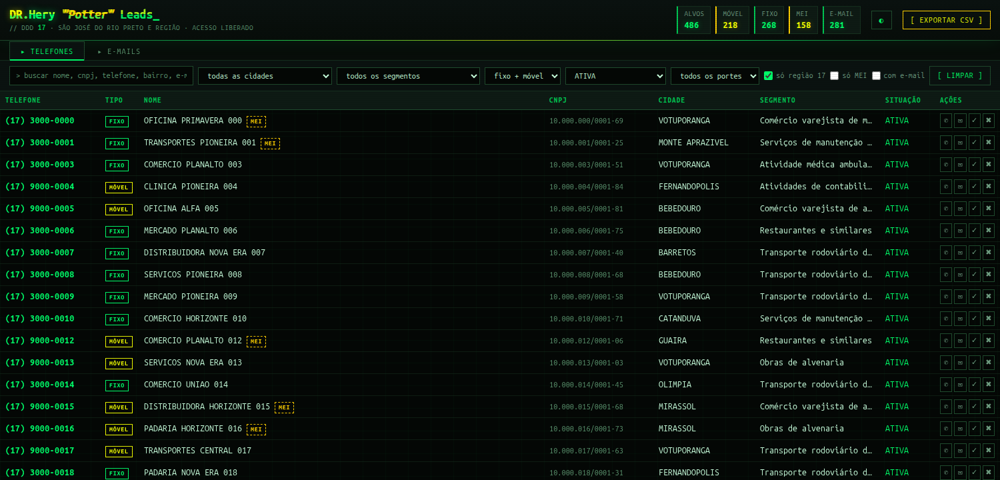
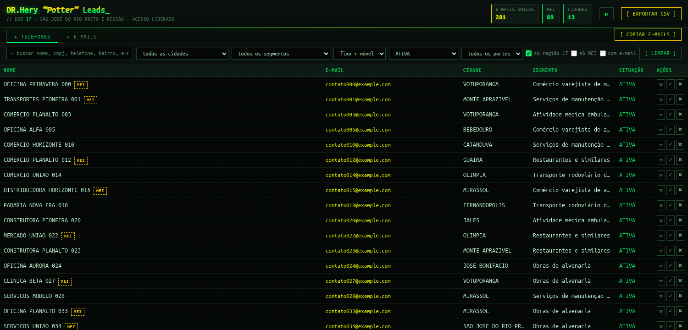

# DR.Hery "Potter" Leads — DDD 17

Extrai contatos comerciais do DDD 17 (São José do Rio Preto e região) dos
**Dados Abertos do CNPJ da Receita Federal** e monta uma página HTML de arquivo
único para filtrar, ordenar e trabalhar os leads — offline, sem servidor nem CDN.



## Os dados não estão neste repositório

Só o código está versionado. A base gerada tem ~1 milhão de telefones e 202 mil
e-mails, boa parte de MEIs e empresários individuais — ou seja, pessoas físicas.
Consultar a fonte pública é uma coisa; republicar o agregado é outra, e não é o
propósito daqui.

Rodando os scripts você reconstrói tudo em ~40 minutos (6,6 GB de download).

## Rodar

```bash
git clone https://github.com/BenezDev/drhery-leads.git
cd drhery-leads
./scripts/download.sh        # ~6,6 GB da Receita, retomável
python3 scripts/extrair.py   # filtra DDD 17 e monta a base
python3 scripts/regiao.py    # apura os municípios da área 17
python3 scripts/gerar_html.py
```

Só precisa de Python 3 (biblioteca padrão), `curl` e `unzip`. Sem dependências
externas.

**Só quer ver a interface?** `python3 scripts/demo.py` gera `demo.html` com 600
registros fictícios, sem baixar nada. As screenshots deste README saíram dele —
por isso os e-mails são `@example.com`.

## Uso

Abra `drhery_leads.html` com duplo clique. Não precisa de servidor, internet nem
instalação — os dados vão embutidos no próprio arquivo (comprimidos com gzip e
descomprimidos pelo navegador na abertura, ~4s). O arquivo final tem ~58 MB.

## O que tem na base

| | |
|---|---|
| Telefones totais | **980.381** |
| Na área do DDD 17 | 917.404 (93,6%) |
| **Ativos na área** (alvo de prospecção) | **497.080** |
| Celulares | 446.378 |
| Fixos | 534.003 |
| MEI | 195.157 |
| Com e-mail | 864.430 |
| Municípios na área | 118 |
| Empresas distintas | 778.517 |

A página já abre filtrada em **ATIVA + região 17** — os 497 mil que valem ligação.

## Estrutura

```
drhery_leads.html      # a página (arquivo único, offline)
preview.png           # screenshot da aba Telefones (dados fictícios)
preview_emails.png    # screenshot da aba E-mails (dados fictícios)
data/out/
  leads_ddd17.csv     # base completa, 24 colunas (UTF-8 com BOM, ';')
  leads_ddd17.json    # mesma base em JSON
  area_ddd17.json     # os 118 municípios da área, com a proporção apurada
  relatorio.json      # estatísticas da extração
data/raw/             # zips originais da Receita, 6,6 GB (podem ser apagados)
scripts/
  download.sh         # baixa os dados abertos (retomável)
  demo.py             # gera demo.html com dados fictícios
  extrair.py          # filtra DDD 17 e monta a base
  regiao.py           # determina quais municípios são da área 17
  gerar_html.py       # gera a página
```

## Atualizar a base

A Receita publica uma competência nova por mês. Para atualizar, troque `2026-08`
em `scripts/download.sh` pela competência desejada e rode **nesta ordem**:

```bash
./scripts/download.sh && python3 scripts/extrair.py && python3 scripts/regiao.py && python3 scripts/gerar_html.py
```

`regiao.py` precisa rodar antes de `gerar_html.py` — é ele que marca quais
municípios pertencem à área do DDD 17. O download é retomável: relançar o script
pula o que já está completo.

## Como a "região 17" é definida

O filtro por DDD do telefone traz junto empresas de fora que cadastraram um
número 17 (6,4% da base — havia leads de Goiás, Pará e Acre no topo da lista).

Em vez de usar uma lista externa ou um limiar arbitrário, a área é derivada dos
próprios dados: para cada município conta-se a proporção de estabelecimentos com
telefone DDD 17 sobre o total. A separação é nítida — 115 dos 118 municípios
ficam acima de 85%, e não há nenhum entre 50% e 70%. Só Planalto/SP (38%) é
fronteira real, entre o 17 e o 14.

Os 118 municípios estão em `data/out/area_ddd17.json` com a proporção apurada.

## Fonte e base legal

Origem única: **Receita Federal — Dados Abertos CNPJ, competência 2026-08**
(https://arquivos.receitafederal.gov.br). Dados de publicação obrigatória, com
licença aberta, em que o telefone é o **contato comercial declarado pelo próprio
titular** no cadastro do CNPJ.

Nenhum dado veio de raspagem, lista comprada ou base vazada.

Como MEIs e empresários individuais costumam cadastrar o celular pessoal como
telefone da empresa, a base tem 446 mil celulares — mas todos declarados
publicamente pelo titular como contato comercial.

### Antes de usar

- **Não Me Perturbe** — consulte https://naomeperturbe.com.br antes de campanhas
  de ligação. O bloqueio é obrigatório e a multa recai sobre quem liga.
- **Opt-out** — o botão ✖ marca o lead como descartado; o estado fica salvo no
  navegador e sai marcado na coluna `status` do CSV exportado.

O aviso de LGPD que ficava no topo da página foi removido a pedido — a orientação
continua valendo e está registrada aqui.
- **Finalidade** — a base tem base legal para contato **comercial B2B**. Outra
  finalidade exige revisar o enquadramento na LGPD.

### Minimização aplicada

A Receita publica a razão social do empresário individual como
`"<inscrição> <NOME>"` ou `"<NOME> <CPF>"`. Esses números foram removidos dos
campos de nome (536 mil registros): não servem para prospecção e, no caso do CPF,
são dado pessoal sem razão para replicar.

## Identidade visual

Tema `DR.Hery "Potter" Leads`: neon verde `#00ff6a` + amarelo `#f2ff00` sobre
preto, tipografia monospace, glitch no título, scanlines e grid — estilo
Watch Dogs 2 / DedSec. Tudo em CSS puro, sem webfont externa (a página é offline),
com fallback para DejaVu Sans Mono.

O botão ◐ alterna para um tema claro. Nele os neons são escurecidos
(`#00752f` / `#755f00`) porque o verde e o amarelo vibrantes reprovam em contraste
sobre fundo claro — todos os pares texto/fundo ficam acima de 4,5:1 (WCAG AA) nos
dois temas.



## As duas abas

**▸ TELEFONES** — a lista de ligação: telefone, tipo, nome, CNPJ, cidade, segmento
e situação, com botões de ligar e WhatsApp.

**▸ E-MAILS** — a lista de disparo: nome e e-mail, mais cidade, segmento e situação.
Aqui os registros são **deduplicados por endereço** — na aba de telefones a mesma
empresa aparece uma vez por número, o que na lista de e-mail viraria envio repetido.

O botão `[ COPIAR E-MAILS ]` copia todos os endereços do filtro atual separados por
`; `, pronto para colar no campo de destinatários. Se o navegador bloquear a área de
transferência (acontece em `file://` em alguns casos), ele baixa a lista em `.txt`.

O `[ EXPORTAR CSV ]` acompanha a aba: na de telefones sai a base completa de 18
colunas; na de e-mails sai `nome;email;cidade;bairro;segmento;cnae;situacao;porte;mei;cnpj;status`.

A aba fica salva — você reabre onde parou. `drhery_leads.html#email` abre direto na
lista de e-mails.

### Sobre o volume de e-mails

São 447 mil linhas com e-mail, mas apenas **202.808 endereços únicos**. A diferença
é grande porque escritórios de contabilidade cadastram o próprio e-mail no CNPJ de
vários clientes. Vale considerar isso antes de tratar a lista como 447 mil contatos
distintos.

## Marcar quem já foi contatado

Cada linha tem dois botões à direita:

- **✓** marca como **contatado**, e a linha fica apagada
- **✖** marca como **descartado / opt-out**, e a linha fica riscada

Clicar de novo no mesmo botão desfaz. O estado é salvo no navegador desta máquina,
por número de telefone — não acompanha outro PC e some se você limpar os dados do
navegador. Mas sai na coluna `status` do CSV exportado (`CONTATADO` / `DESCARTADO`),
então o registro não se perde.

## Nomes não detectados

A Receita aceita qualquer coisa no campo de nome: há registros com `*`, `-`,
`3152` e iniciais soltas. Esses casos (939, ou 0,1% da base) aparecem como
**NÃO DETECTADO** em vez de exibir lixo ou repetir o CNPJ que já está na coluna
ao lado. O número de inscrição também é removido do nome quando vem grudado
(`"NOME 08431158824"`).

## Limitações conhecidas

**Separação por operadora não foi incluída.** Dois motivos:

1. Desde a portabilidade numérica (2008), o prefixo não identifica a operadora —
   um número originalmente Vivo pode estar na Claro há anos. A única fonte
   autoritativa é a consulta da ABR Telecom, número a número, sem licença para
   uso em massa.
2. O arquivo público de faixas SMP da ABR Telecom (`easi.abrtelecom.com.br` →
   Arquivos Públicos → SMP) retornava **HTTP 400 em todos os downloads** na data
   desta extração — indisponibilidade do lado deles, não de acesso.

Se o portal normalizar, o `SMP_*_GERAL.zip` dá a **operadora de alocação
original** do prefixo — estimativa útil, nunca dado confirmado. O endpoint é
`/nsapn-api/v1/public/files/download/{hashUuid}`, com o hashUuid vindo de
`/nsapn-api/v1/public/files/smp`.

**Outras**
- Telefones inválidos (zeros, repetições, sequências) são descartados: 14 mil.
- Celulares antigos de 8 dígitos recebem o nono dígito automaticamente.
- A situação cadastral é a da competência; empresas podem ter mudado desde então.
- Um lead por telefone: empresas com dois telefones aparecem em duas linhas.
